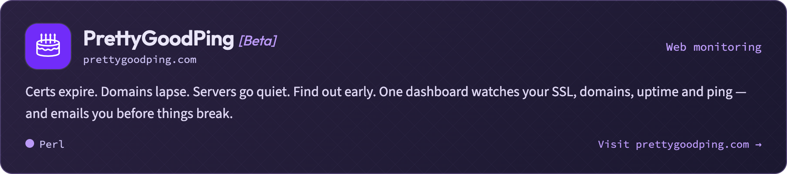
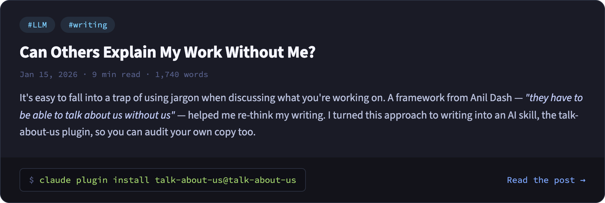

# Olaf Alders

> Building the things that nobody is asking for.

I build developer communities through open source. I'm the founder of [MetaCPAN](https://metacpan.org), where I've spent over a decade sustaining a global developer community and creating tooling used by thousands of developers daily. I maintain foundational Perl libraries including [libwww-perl](https://metacpan.org/dist/libwww-perl) and [URI](https://metacpan.org/dist/URI), and I'm the author of [perlimports](https://github.com/perl-doc-cats/perlimports).

Currently raising funds for [The Perl and Raku Foundation](https://www.perlfoundation.org/), co-hosting [The Underbar](https://theunderbar.net/) podcast, and editing [perl.com](https://perl.com) and [The Perl Advent Calendar](https://perladvent.org/).

### `$ ls ~/pinned`

[](https://mymindisracing.com)

[](https://prettygoodping.com)

### `$ cat ~/posts/latest.md`

[](https://www.olafalders.com/2026/01/15/can-others-explain-my-work-without-me/)

```bash
claude plugin marketplace add oalders/talk-about-us &&
claude plugin install talk-about-us@talk-about-us
```

### `$ whoami --contact`

- [Blog](https://www.olafalders.com/) · [Newsletter](https://wundersolutions-com.eo.page/k22w4)
- [Mastodon](https://fosstodon.org/@oalders) · [LinkedIn](https://www.linkedin.com/in/olafalders)
